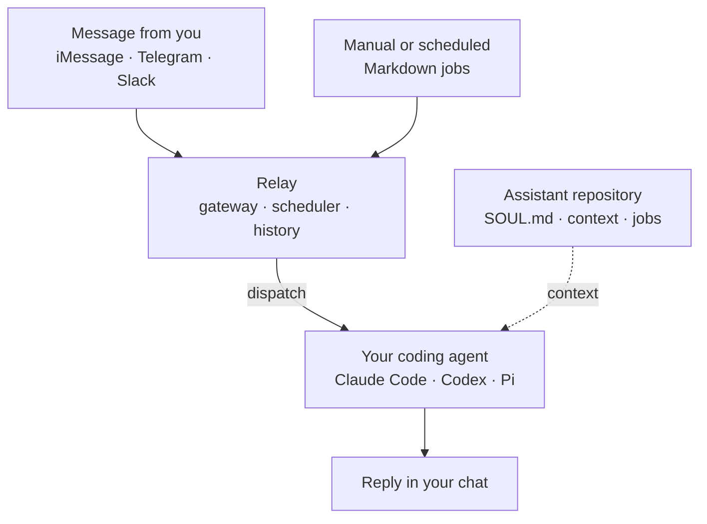

```
██████╗ ███████╗██╗      █████╗ ██╗   ██╗
██╔══██╗██╔════╝██║     ██╔══██╗╚██╗ ██╔╝
██████╔╝█████╗  ██║     ███████║ ╚████╔╝
██╔══██╗██╔══╝  ██║     ██╔══██║  ╚██╔╝
██║  ██║███████╗███████╗██║  ██║   ██║
╚═╝  ╚═╝╚══════╝╚══════╝╚═╝  ╚═╝   ╚═╝
```

# Relay

> [!NOTE]
> EdHeltzel's Agent Relay

### Your agent stays on your machine. Relay keeps it within reach.

Relay is the thin wire between your phone and the coding agent already
configured on your machine. Send a chat message or schedule a Markdown job;
Relay carries the request in and the answer back without replacing your
agent's models, tools, skills, or permissions.

[](https://github.com/edheltzel/Relay/actions/workflows/ci.yml)
[](docs/index.md)
[](LICENSE)

[Send your first message](#how-to-send-your-first-message) · [Choose a channel](#use-another-channel) · [Read the docs](docs/index.md)

## How to send your first message

Start with Telegram because it is the shortest route to a private round trip.
By the end, a message from your phone will reach Pi on your computer and its
reply will return to the same chat. Prefer Claude Code or Codex? Change one
config value.

### Prerequisites

Before you begin, you need:

- Apple Silicon macOS or x86_64 Linux for the prebuilt release
- Git and the [GitHub CLI](https://cli.github.com/)
- `tar` and either `shasum` or `sha256sum` for the verified installer
- Access to this private GitHub repository
- Claude Code, Codex, or Pi installed and signed in
- A Telegram account

Confirm that GitHub CLI can access the repository:

```sh
gh auth status
gh repo view edheltzel/Relay --json nameWithOwner --jq .nameWithOwner
```

The second command should print `edheltzel/Relay`. If either command fails, run
`gh auth login`, then try both checks again.

### 1. Confirm your coding agent works

Run the command for the agent you want Relay to use:

- Pi: `pi --version`
- Claude Code: `claude --version`
- Codex: `codex --version`

A version confirms that the command is installed. If you have not used the
agent as this operating-system user, launch it once and finish signing in.
Relay then reuses its login, tools, skills, permissions, and configuration.

### 2. Install Relay

Copy and run this command:

```sh
tmp="$(mktemp)" && (trap 'rm -f "$tmp"' 0; gh api -H "Accept: application/vnd.github.raw+json" 'repos/edheltzel/Relay/contents/install.sh?ref=master' >"$tmp" && sh "$tmp")
```

Confirm the installation:

```sh
relay --version
```

If your shell reports `relay: command not found`, follow the
[shell-specific PATH instructions](#relay-is-not-found), then run
`relay --version` again.

### 3. Create your assistant repository

Choose where you want to keep your assistant, then run:

```sh
relay init ~/Developer/assistant
```

This creates a separate Git repository for your assistant's identity,
instructions, context, evaluations, and scheduled jobs. It also creates
`~/.relay/config.toml` and records the assistant repository path there.

You can change the assistant later by editing:

- `SOUL.md` for identity and operating style
- `AGENTS.md` for shared instructions
- `context/` for durable context
- `jobs/` for manual or scheduled work

You do not need to edit those files before sending your first message.

### 4. Create a Telegram bot

1. Open a private chat with Telegram's official `@BotFather` account.
2. Send `/newbot` and follow the prompts.
3. Copy the bot token.
4. Open a private chat with your new bot and send it one message.

Keep the token private. Anyone with it can control your bot.

### 5. Find your Telegram user ID

Relay accepts numeric Telegram IDs, not usernames. Use a trusted ID lookup bot,
or inspect the official Bot API `getUpdates` response:

1. Open a private browser window.
2. Replace `<YOUR_BOT_TOKEN>` in this URL with the token from BotFather:

   ```text
   https://api.telegram.org/bot<YOUR_BOT_TOKEN>/getUpdates
   ```

3. Find the number in `message.from.id`.
4. Close the private window. Do not share the URL because it contains your bot
   token.

For more context, see Telegram's official
[`getUpdates` documentation](https://core.telegram.org/bots/api#getupdates).

### 6. Configure Relay for Telegram

Open `~/.relay/config.toml` and set the agent, bot token, and numeric user ID:

```toml
channel = "telegram"
agent = "pi"
assistant_root = "~/Developer/assistant"

[telegram]
bot_token = "token-from-BotFather"
allow_user_ids = [123456789]
```

Use `agent = "claude"` for Claude Code or `agent = "codex"` for Codex. Save
the file.
`relay init` creates it with owner-only permissions.

For token storage, allowlisting, and routing options, read the
[Telegram setup guide](docs/telegram.md).

### 7. Validate the setup

Run:

```sh
relay doctor
```

Relay checks the config, assistant repository, Telegram settings, and selected
agent. Fix each reported failure, then rerun `relay doctor` until it exits
successfully.

### 8. Start Relay

Run Relay in the foreground:

```sh
relay
```

Leave that terminal open. Relay is ready when the terminal prints
`telegram gateway running`.

### 9. Send your first message

After Relay starts, send your bot a **new** message:

> Reply with exactly: Relay is working.

Telegram messages sent before the first startup are deliberately skipped, so
send a new message even if you already messaged the bot during setup.

### Verify it worked

Your setup works when:

1. `relay doctor` exits successfully.
2. Relay accepts the new Telegram message without an error.
3. Your coding agent replies with `Relay is working.` in the same private chat.

Press `Ctrl-C` to stop the foreground process. To keep Relay running after you
close the terminal, follow [How to run Relay as a service](docs/services.md).

## Troubleshooting

### `relay` is not found

Relay installs to `~/.local/bin`. Use the command for your shell, then confirm
that `relay --version` works.

#### Fish

[`fish_add_path`](https://fishshell.com/docs/current/cmds/fish_add_path.html)
persists the directory as a universal variable:

```fish
fish_add_path $HOME/.local/bin
relay --version
```

#### Zsh

```zsh
printf '\nexport PATH="$HOME/.local/bin:$PATH"\n' >> "$HOME/.zshrc"
source "$HOME/.zshrc"
relay --version
```

#### Bash

```bash
printf '\nexport PATH="$HOME/.local/bin:$PATH"\n' >> "$HOME/.bashrc"
source "$HOME/.bashrc"
relay --version
```

If you use Bash as a login shell on macOS, use `~/.bash_profile` instead of
`~/.bashrc`.

#### NixOS

Add the official
[`environment.localBinInPath`](https://nixos.org/manual/nixos/stable/options#opt-environment.localBinInPath)
option to `/etc/nixos/configuration.nix`:

```nix
{
  environment.localBinInPath = true;
  programs.nix-ld.enable = true;
}
```

Apply the configuration and verify Relay:

```bash
sudo nixos-rebuild switch
relay --version
```

[`programs.nix-ld`](https://search.nixos.org/options?show=programs.nix-ld.enable&query=programs.nix-ld.enable)
lets NixOS run the dynamically linked Linux release binary.
If you do not want to enable it, [build Relay from source](#build-from-source)
inside your Nix environment.

#### Nushell

Open the Nushell config with `config nu`, then add the current standard-library
PATH helper:

```nu
use std/util "path add"
path add "~/.local/bin"
```

Start a new Nushell session, then run:

```nu
relay --version
```

See the official
[Nushell configuration guide](https://www.nushell.sh/book/configuration.html)
for more PATH options.

#### WSL on Windows with PowerShell — untested

Relay has not been tested on Windows Subsystem for Linux (WSL). Install and run
the Linux binary inside your WSL distribution; adding it to Windows
`$env:Path` will not make the Linux executable run natively on Windows.

This PowerShell example assumes your WSL distribution has Bash. It adds Relay
to the WSL user's Bash path without duplicating the line:

```powershell
wsl.exe bash -lc 'grep -qxF ''export PATH="$HOME/.local/bin:$PATH"'' "$HOME/.bashrc" || printf ''\nexport PATH="$HOME/.local/bin:$PATH"\n'' >> "$HOME/.bashrc"'
wsl.exe bash -ic 'relay --version'
```

For Fish, Zsh, or Nushell inside WSL, open that shell in WSL and use its
shell-specific instructions above. See Microsoft's
[WSL command reference](https://learn.microsoft.com/windows/wsl/basic-commands)
for distribution and user-selection options.

### The installer cannot access the release

This repository and its releases are private. Authenticate GitHub CLI with an
account that has access:

```sh
gh auth login
gh auth status
```

Then run the install command again.

### `relay doctor` cannot find the coding agent

Run the command for your selected agent:

- Codex: `codex --version`
- Claude Code: `claude --version`
- Pi: `pi --version`

Install or sign in to the agent if that command fails. Make sure the agent is
available to the same operating-system user that runs Relay.

### Telegram does not reply

Check these common causes:

- Send a new message after the terminal prints `telegram gateway running`.
- Confirm `allow_user_ids` contains your numeric user ID, not your username.
- Confirm the bot token came from the same bot you are messaging.
- Run only one Relay process for a Telegram bot.
- Read the terminal output and rerun `relay doctor`.

Relay does not bypass your coding agent's sandbox or approval policy. If the
agent needs approval in a terminal, it needs the equivalent permission when
Relay starts it.

## Use another channel

Once the basic setup works, you can switch channels without rebuilding your
assistant:

- **Telegram:** Works on macOS and Linux and requires no inbound port. Follow
  the [Telegram guide](docs/telegram.md).
- **iMessage:** Works on macOS and supports a private conversation with
  yourself. Follow the [iMessage guide](docs/channels/imessage.md).
- **Slack:** Works through Socket Mode on macOS and Linux. Follow the
  [Slack guide](docs/slack.md).

You can also configure multiple channels and route each chat to a different
agent. See the [configuration guide](docs/configuration.md).

## What makes Relay different

Relay owns the handoff, not the intelligence. It does not ship another model
runtime, tool system, skill format, or memory layer. Instead, it:

- Gives your existing Claude Code, Codex, or Pi setup private chat endpoints
- Keeps conversation and job history across restarts
- Runs one-off or scheduled Markdown jobs
- Opens no inbound network port
- Keeps assistant instructions in a Git repository you control

Your coding agent still decides how to reason, which tools to use, and when it
needs approval. Relay decides how trusted work arrives and where the result
goes.

## How Relay works



## Give recurring work a Markdown file

If you can describe the work in Markdown, Relay can run it now or later. A job
pairs a prompt with an optional schedule; Relay validates it, runs it through
your selected coding agent, records the result, and can deliver it to a chat.

- [Create and run a job](docs/jobs.md)
- [See an email-triage job](examples/assistant/jobs/daily-inbox-triage.md)

## Build from source

If you use another Rust-supported platform or want to test `master`, install the
stable Rust toolchain and run:

```sh
git clone https://github.com/edheltzel/Relay.git relay
cd relay
cargo build --locked --release
```

The binary will be at `target/release/relay`.

## Next steps

- [Complete documentation](docs/index.md)
- [Design your assistant repository](docs/designing-an-assistant.md)
- [Configure Relay](docs/configuration.md)
- [Review permissions and security](docs/security.md)
- [Inspect every CLI command](docs/reference/cli.md)

Relay is early software. Read the [security policy](SECURITY.md) before
reporting a vulnerability. Bug reports, ideas, and pull requests are welcome.

- [Contributing](CONTRIBUTING.md)
- [Code of conduct](CODE_OF_CONDUCT.md)
- [Security policy](SECURITY.md)
- [MIT license](LICENSE)
