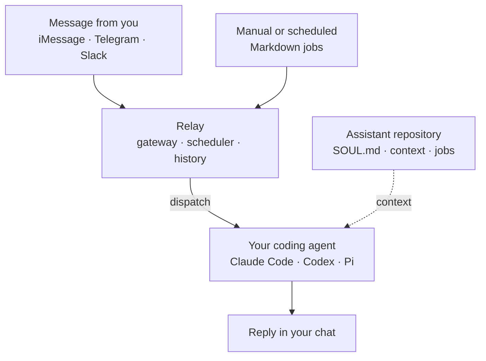

<div align="center">

# Relay

### Text your coding agent from anywhere.

Use Claude Code, Codex, or Pi through Telegram, iMessage, or Slack. Run work on
a schedule. Keep Relay, your agent, and your assistant files on your own
machine.

[](https://github.com/edheltzel/relay/actions/workflows/ci.yml)
[](docs/index.md)
[](LICENSE)

[Send your first message](#how-to-send-your-first-message) · [Choose a channel](#use-another-channel) · [Read the docs](docs/index.md)

</div>

## How to send your first message

The fastest setup uses a private Telegram bot. You will install Relay, connect
one coding agent, and send it a message from your phone. The example uses Codex;
you can choose Claude Code or Pi by changing one config value.

### Prerequisites

Before you begin, you need:

- Apple Silicon macOS or x86_64 Linux for the prebuilt release
- Git and the [GitHub CLI](https://cli.github.com/)
- `tar` and either `shasum` or `sha256sum` for the verified installer
- Access to this private GitHub repository
- Claude Code, Codex, or Pi installed and signed in
- A Telegram account

Confirm that GitHub CLI can access the repository:

```sh
gh auth status
```

If it is not signed in, run `gh auth login` and follow the prompts.

### 1. Confirm your coding agent works

Run the command for the agent you want Relay to use:

- Codex: `codex --version`
- Claude Code: `claude --version`
- Pi: `pi --version`

Continue when your chosen command prints a version without asking you to sign
in. Relay uses that agent's existing login, tools, skills, permissions, and
configuration.

### 2. Install Relay

Copy and run this command:

```sh
tmp="$(mktemp)" && (trap 'rm -f "$tmp"' 0; gh api -H "Accept: application/vnd.github.raw+json" 'repos/edheltzel/relay/contents/install.sh?ref=master' >"$tmp" && sh "$tmp")
```

Confirm the installation:

```sh
relay --version
```

If your shell reports `relay: command not found`, add Relay's install directory
to your current session:

```sh
export PATH="$HOME/.local/bin:$PATH"
```

Add the same line to your shell startup file to keep it available in new
terminals.

### 3. Create your assistant repository

Choose where you want to keep your assistant, then run:

```sh
relay init ~/Developer/assistant
```

This creates a separate Git repository for your assistant's identity,
instructions, context, evaluations, and scheduled jobs. It also creates
`~/.relay/config.toml` and records the assistant repository path there.

You can change the assistant later by editing:

- `SOUL.md` for identity and operating style
- `AGENTS.md` for shared instructions
- `context/` for durable context
- `jobs/` for manual or scheduled work

You do not need to edit those files before sending your first message.

### 4. Create a Telegram bot

1. Open a private chat with Telegram's official `@BotFather` account.
2. Send `/newbot` and follow the prompts.
3. Copy the bot token.
4. Open a private chat with your new bot and send it one message.

Keep the token private. Anyone with it can control your bot.

### 5. Find your Telegram user ID

Relay accepts numeric Telegram IDs, not usernames. Use a trusted ID lookup bot,
or inspect the official Bot API `getUpdates` response:

1. Open a private browser window.
2. Replace `<YOUR_BOT_TOKEN>` in this URL with the token from BotFather:

   ```text
   https://api.telegram.org/bot<YOUR_BOT_TOKEN>/getUpdates
   ```

3. Find the number in `message.from.id`.
4. Close the private window. Do not share the URL because it contains your bot
   token.

For more context, see Telegram's official
[`getUpdates` documentation](https://core.telegram.org/bots/api#getupdates).

### 6. Configure Relay for Telegram

Open `~/.relay/config.toml` and set the agent, bot token, and numeric user ID:

```toml
channel = "telegram"
agent = "codex"
assistant_root = "~/Code/assistant"

[telegram]
bot_token = "token-from-BotFather"
allow_user_ids = [123456789]
```

Use `agent = "claude"` for Claude Code or `agent = "pi"` for Pi. Save the file.
`relay init` creates it with owner-only permissions.

For token storage, allowlisting, and routing options, read the
[Telegram setup guide](docs/telegram.md).

### 7. Validate the setup

Run:

```sh
relay doctor
```

Relay checks the config, assistant repository, Telegram settings, and selected
agent. Fix each reported failure, then rerun `relay doctor` until it exits
successfully.

### 8. Start Relay

Run Relay in the foreground:

```sh
relay
```

Leave that terminal open. Relay is ready when the terminal prints
`telegram gateway running`.

### 9. Send your first message

After Relay starts, send your bot a **new** message:

> Reply with exactly: Relay is working.

Telegram messages sent before the first startup are deliberately skipped, so
send a new message even if you already messaged the bot during setup.

### Verify it worked

Your setup works when:

1. `relay doctor` exits successfully.
2. Relay accepts the new Telegram message without an error.
3. Your coding agent replies with `Relay is working.` in the same private chat.

Press `Ctrl-C` to stop the foreground process. To keep Relay running after you
close the terminal, follow [How to run Relay as a service](docs/services.md).

## Troubleshooting

### `relay` is not found

Relay installs to `~/.local/bin`. Run:

```sh
export PATH="$HOME/.local/bin:$PATH"
relay --version
```

Then add the export line to `~/.zshrc`, `~/.bashrc`, or your shell's equivalent.

### The installer cannot access the release

This repository and its releases are private. Authenticate GitHub CLI with an
account that has access:

```sh
gh auth login
gh auth status
```

Then run the install command again.

### `relay doctor` cannot find the coding agent

Run the command for your selected agent:

- Codex: `codex --version`
- Claude Code: `claude --version`
- Pi: `pi --version`

Install or sign in to the agent if that command fails. Make sure the agent is
available to the same operating-system user that runs Relay.

### Telegram does not reply

Check these common causes:

- Send a new message after the terminal prints `telegram gateway running`.
- Confirm `allow_user_ids` contains your numeric user ID, not your username.
- Confirm the bot token came from the same bot you are messaging.
- Run only one Relay process for a Telegram bot.
- Read the terminal output and rerun `relay doctor`.

Relay does not bypass your coding agent's sandbox or approval policy. If the
agent needs approval in a terminal, it needs the equivalent permission when
Relay starts it.

## Use another channel

Once the basic setup works, you can switch channels without rebuilding your
assistant:

- **Telegram:** Works on macOS and Linux and requires no inbound port. Follow
  the [Telegram guide](docs/telegram.md).
- **iMessage:** Works on macOS and supports a private conversation with
  yourself. Follow the [iMessage guide](docs/channels/imessage.md).
- **Slack:** Works through Socket Mode on macOS and Linux. Follow the
  [Slack guide](docs/slack.md).

You can also configure multiple channels and route each chat to a different
agent. See the [configuration guide](docs/configuration.md).

## What Relay does

- Uses your existing Claude Code, Codex, or Pi setup
- Connects private iMessage, Telegram, and Slack chats
- Keeps conversation and job history between restarts
- Runs one-off or scheduled Markdown jobs
- Opens no inbound network port
- Keeps assistant instructions in a Git repository you control

Relay is a small bridge, not another agent runtime. Your coding agent still
controls its models, tools, skills, permissions, and reasoning.

## How Relay works



## Run work on a schedule

Jobs are Markdown files with a prompt and optional schedule. Relay validates
them, runs them through your selected coding agent, records the result, and can
deliver it to a configured chat.

- [Create and run a job](docs/jobs.md)
- [See an email-triage job](examples/assistant/jobs/daily-inbox-triage.md)

## Build from source

If you use another Rust-supported platform or want to test `master`, install the
stable Rust toolchain and run:

```sh
git clone https://github.com/edheltzel/relay.git
cd relay
cargo build --locked --release
```

The binary will be at `target/release/relay`.

## Next steps

- [Complete documentation](docs/index.md)
- [Design your assistant repository](docs/designing-an-assistant.md)
- [Configure Relay](docs/configuration.md)
- [Review permissions and security](docs/security.md)
- [Inspect every CLI command](docs/reference/cli.md)

Relay is early software. Read the [security policy](SECURITY.md) before
reporting a vulnerability. Bug reports, ideas, and pull requests are welcome.

- [Contributing](CONTRIBUTING.md)
- [Code of conduct](CODE_OF_CONDUCT.md)
- [Security policy](SECURITY.md)
- [MIT license](LICENSE)
